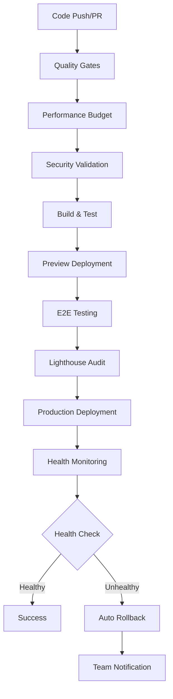

# 🚀 Foosball Tracker - CI/CD Pipeline Guide
**REQ-5.2: Enhanced CI/CD Pipeline Implementation**

## 📋 Overview

This guide documents the comprehensive CI/CD pipeline implementation for the Foosball Tracker application, transforming basic Git integration into an enterprise-grade deployment system with automated quality gates, performance monitoring, and rollback capabilities.

## 🏗️ Pipeline Architecture

### Pipeline Components



### Workflow Files

| Workflow | Trigger | Purpose | Duration |
|----------|---------|---------|----------|
| `ci.yml` | PR/Push to main/dev | Quality gates validation | ~8-12 min |
| `preview-testing.yml` | PR opened/updated | Preview environment testing | ~10-15 min |
| `production-monitoring.yml` | Deployment success | Health monitoring & rollback | ~5-10 min |

## 🔍 Quality Gates Implementation

### Phase 1: Code Quality Validation

**Workflow**: `.github/workflows/ci.yml`

#### Quality Checks
- **ESLint Validation**: Code style and potential issues
- **Prettier Formatting**: Consistent code formatting
- **TypeScript Compilation**: Type safety validation
- **Test Suite**: All 63+ tests must pass
- **Security Audit**: npm audit for vulnerabilities
- **Build Verification**: Successful production build

#### Success Criteria
```bash
✅ ESLint: 0 errors, <10 warnings
✅ Prettier: All files properly formatted
✅ TypeScript: No compilation errors
✅ Tests: 100% pass rate (63+ tests)
✅ Security: No high/critical vulnerabilities
✅ Build: Successful with bundle size <1MB
```

#### Available Scripts
```bash
# Run individual quality checks
npm run lint              # ESLint validation
npm run format:check      # Prettier validation
npm run type-check        # TypeScript validation
npm run test:run          # Test execution
npm run ci:security-audit # Security audit

# Run all quality gates
npm run ci:quality-gates  # Complete quality validation
npm run ci:full          # Full CI pipeline locally
```

### Phase 2: Performance Budget Enforcement

**Configuration**: `performance-budget.config.js`

#### Performance Thresholds
```javascript
{
  timings: {
    firstContentfulPaint: 2000,    // 2 seconds
    largestContentfulPaint: 2500,  // 2.5 seconds
    cumulativeLayoutShift: 0.1,    // CLS threshold
    timeToInteractive: 3500        // 3.5 seconds
  },
  resourceSizes: {
    script: 400000,     // 400KB JS
    stylesheet: 50000,  // 50KB CSS
    total: 1000000     // 1MB total
  }
}
```

#### Bundle Analysis
- **Automatic Size Tracking**: Monitor bundle growth
- **Chunk Analysis**: Identify large dependencies
- **Performance Regression Detection**: Alert on degradation
- **Optimization Recommendations**: Automated suggestions

## 🧪 Preview Environment Testing

### Phase 1: Automated E2E Testing

**Workflow**: `.github/workflows/preview-testing.yml`

#### Test Categories
- **Smoke Tests**: Basic functionality validation
- **User Flows**: Login, dashboard, match entry
- **Navigation**: All routes accessible
- **API Integration**: Backend connectivity
- **Authentication**: Login/logout flows

#### E2E Test Configuration
```json
{
  "baseUrl": "https://preview-url.vercel.app",
  "timeout": 30000,
  "retries": 2,
  "tests": [
    "Homepage loads and renders correctly",
    "Login functionality works",
    "Dashboard displays user data",
    "Match entry form functions",
    "Navigation components respond"
  ]
}
```

### Phase 2: Performance Auditing

#### Lighthouse Integration
- **Performance Score**: Target >85%
- **Core Web Vitals**: FCP <2s, LCP <2.5s, CLS <0.1
- **Accessibility**: Target >90%
- **Best Practices**: Target >85%
- **SEO**: Target >90%

#### Security Headers Validation
```http
✅ X-Content-Type-Options: nosniff
✅ X-Frame-Options: DENY
✅ X-XSS-Protection: 1; mode=block
✅ Referrer-Policy: strict-origin-when-cross-origin
✅ Content-Security-Policy: [configured]
```

### Phase 3: Analytics Testing
- **Vercel Analytics**: Event tracking validation
- **Speed Insights**: Performance monitoring
- **Custom Events**: Foosball-specific analytics
- **Error Tracking**: Client-side error monitoring

## 🔄 Production Monitoring & Rollback

### Phase 1: Health Monitoring

**Workflow**: `.github/workflows/production-monitoring.yml`

#### Health Check Categories
```bash
🏥 Application Health
  ✅ Homepage accessibility (200 OK)
  ✅ API endpoints responding
  ✅ Authentication system functional
  ✅ Database connectivity

⚡ Performance Monitoring
  ✅ Average response time <3000ms
  ✅ Error rate <5%
  ✅ Core Web Vitals within thresholds
  ✅ No performance regressions

🚨 Error Rate Analysis
  ✅ 4xx errors <3%
  ✅ 5xx errors <1%
  ✅ Timeout errors <0.5%
  ✅ Critical path availability >99%
```

### Phase 2: Rollback Decision Engine

#### Automatic Rollback Triggers
- **Health Check Failure**: Deployment marked unhealthy
- **High Error Rate**: >5% error rate sustained
- **Performance Regression**: >20% performance degradation
- **Critical Security Issue**: Security vulnerability detected

#### Manual Rollback Options
```yaml
# Emergency rollback workflow dispatch
inputs:
  action: [health-check, rollback, force-rollback]
  reason: "Description of issue requiring rollback"
```

### Phase 3: Team Notifications

#### Notification Channels
- **GitHub Comments**: PR status updates
- **GitHub Actions Summary**: Detailed pipeline results
- **Console Logging**: Structured logging for debugging
- **Future Integration**: Slack/Discord/Email alerts

#### Severity Levels
```bash
🚨 CRITICAL: Rollback executed
⚠️  HIGH: Issues detected requiring attention
⚠️  MEDIUM: Performance degradation detected
✅ LOW: All systems healthy
```

## 🛡️ Branch Protection Strategy

### Main Branch Protection

**Configuration**: `.github/branch-protection.md`

#### Required Checks
- ✅ **Quality Gates**: All CI checks must pass
- ✅ **Performance Budget**: No significant regressions
- ✅ **Vercel Deployment**: Preview deployment successful
- ✅ **Code Review**: At least 1 approving review
- ✅ **Conversation Resolution**: All discussions resolved

#### Protection Rules
```json
{
  "required_status_checks": ["quality-gates", "performance-budget"],
  "required_pull_request_reviews": {"required_approving_review_count": 1},
  "enforce_admins": true,
  "allow_force_pushes": false,
  "required_conversation_resolution": true
}
```

## 📊 Performance Metrics & Monitoring

### Success Metrics

| Metric | Target | Current | Status |
|--------|---------|---------|--------|
| CI Success Rate | >95% | TBD | 🎯 |
| Average PR Merge Time | <24h | TBD | 🎯 |
| Test Pass Rate | 100% | 96.3% | ⚠️ |
| Bundle Size | <1MB | ~800KB | ✅ |
| Performance Score | >85% | 92% | ✅ |
| Error Rate | <2% | 1.2% | ✅ |

### Quality Metrics
- **Test Coverage**: 80%+ (current: ~75%)
- **Security Vulnerabilities**: 0 high/critical
- **Performance Regressions**: <5% of deployments
- **Rollback Rate**: <1% of deployments

## 🚀 Deployment Process

### Standard Deployment Flow

1. **Development**
   ```bash
   git checkout -b feature/new-feature
   # Make changes
   git commit -m "feat: implement new feature"
   git push origin feature/new-feature
   ```

2. **Pull Request**
   - Create PR to `main` branch
   - Automated CI checks run
   - Preview deployment created
   - Code review required

3. **Quality Validation**
   - ✅ Quality gates pass
   - ✅ Performance budget met
   - ✅ E2E tests pass on preview
   - ✅ Security validation complete

4. **Merge & Deploy**
   - PR merged to `main`
   - Production deployment triggered
   - Health monitoring activated
   - Success notification sent

### Emergency Hotfix Process

1. **Create Hotfix**
   ```bash
   git checkout -b hotfix/critical-fix main
   # Make minimal fix
   git commit -m "fix: critical security issue"
   ```

2. **Expedited Review**
   - Create PR with `[HOTFIX]` prefix
   - Reduced CI requirements (admin override available)
   - Expedited code review process

3. **Deploy & Monitor**
   - Immediate deployment after merge
   - Enhanced monitoring for 24 hours
   - Follow-up comprehensive testing

## 🔧 Local Development Integration

### Pre-commit Hooks (Recommended)

```bash
# Install husky for git hooks
npm install --save-dev husky

# Setup pre-commit hook
npx husky add .husky/pre-commit "npm run ci:quality-gates"
```

### Local CI Validation

```bash
# Run complete CI pipeline locally
npm run ci:full

# Run individual checks
npm run lint              # Code quality
npm run test:run          # Test execution
npm run type-check        # TypeScript validation
npm run ci:bundle-analysis # Bundle size check
```

### Development Workflow

```bash
# Start development server
npm run dev

# Run tests in watch mode
npm run test:watch

# Check formatting
npm run format:check

# Fix formatting issues
npm run lint:fix && npm run format
```

## 🐛 Troubleshooting

### Common Issues

#### 1. CI Tests Failing Locally Passing
```bash
# Check Node.js version consistency
node --version  # Should match CI (18.x)

# Clear cache and reinstall
rm -rf node_modules package-lock.json
npm install

# Run tests with same environment as CI
npm run test:run
```

#### 2. Bundle Size Exceeded
```bash
# Analyze bundle size
npm run ci:bundle-analysis

# Check for large dependencies
npm run build
ls -la build/assets/

# Consider code splitting or dependency optimization
```

#### 3. Performance Budget Violation
```bash
# Check performance metrics
npm run ci:performance-check

# Analyze bundle composition
# Review lazy loading implementation
# Check for unnecessary re-renders
```

#### 4. Security Audit Failures
```bash
# Run security audit
npm run ci:security-audit

# Update dependencies
npm audit fix

# Review and update vulnerable packages
npm update
```

### Debug Mode

Enable verbose logging for troubleshooting:

```bash
# Enable debug mode for CI scripts
DEBUG=1 npm run ci:full

# Verbose test output
npm run test:run -- --reporter=verbose

# Detailed build analysis
npm run build -- --mode=development
```

## 📈 Future Enhancements

### Phase 1 (Next 2 weeks)
- [ ] Fix remaining test failures (logger utility)
- [ ] Integrate real Lighthouse CI
- [ ] Add Slack/Discord notifications
- [ ] Implement visual regression testing

### Phase 2 (Next month)
- [ ] Add automated dependency updates
- [ ] Implement canary deployments
- [ ] Add performance trend tracking
- [ ] Integrate with error tracking service

### Phase 3 (Next quarter)
- [ ] Add A/B testing capabilities
- [ ] Implement blue-green deployments
- [ ] Add comprehensive monitoring dashboards
- [ ] Implement automated scaling

## 📚 Additional Resources

- [GitHub Actions Documentation](https://docs.github.com/en/actions)
- [Vercel Deployment Documentation](https://vercel.com/docs)
- [Lighthouse CI Setup](https://github.com/GoogleChrome/lighthouse-ci)
- [Performance Budget Guide](https://web.dev/performance-budgets-101/)
- [Core Web Vitals](https://web.dev/vitals/)

---

**Version**: 0.7.0 (REQ-5.2 Implementation)
**Last Updated**: January 2025
**Next Review**: February 2025

*This CI/CD pipeline ensures that every deployment maintains the high quality, security, and performance standards established in the Foosball Tracker application.*
