# 🌿 Feature Branch Workflow Guide

**Foosball Tracker - Automated Branch Management v0.8.1**

## 📋 Overview

This guide outlines the automated feature branch workflow implemented for the Foosball Tracker application. The workflow ensures code quality, proper testing, and deployment safety through automated validation and branch protection rules.

## 🎯 Workflow Architecture

```mermaid
graph TD
    A[Developer Creates Branch] --> B{Branch Name Valid?}
    B -->|No| C[❌ Branch Validation Fails]
    B -->|Yes| D[✅ Branch Validation Passes]
    D --> E[Developer Makes Changes]
    E --> F[Push to Branch]
    F --> G[🔍 CI Quality Gates Run]
    G --> H{Quality Gates Pass?}
    H -->|No| I[❌ Fix Issues]
    H -->|Yes| J[Create Pull Request]
    J --> K{PR Target Valid?}
    K -->|No| L[❌ PR Validation Fails]
    K -->|Yes| M[✅ PR Validation Passes]
    M --> N[🧪 Preview Testing]
    N --> O{Preview Tests Pass?}
    O -->|No| P[❌ Fix Issues]
    O -->|Yes| Q[👥 Code Review]
    Q --> R[🚀 Merge to Target]
    R --> S{Target Branch?}
    S -->|dev| T[🔧 Development Deployment]
    S -->|main| U[🏭 Production Deployment]
```



## 🌿 Branch Naming Conventions

### Required Patterns

All branches must follow one of these naming patterns:

| Pattern                     | Purpose             | Target Branch   | Example                              |
| --------------------------- | ------------------- | --------------- | ------------------------------------ |
| `feature/{description}`     | New features        | `dev`           | `feature/user-authentication`        |
| `bugfix/{description}`      | Bug fixes           | `dev`           | `bugfix/login-validation-error`      |
| `hotfix/{description}`      | Emergency fixes     | `main` or `dev` | `hotfix/security-patch`              |
| `req-{x}-{x}-{description}` | REQ implementations | `dev`           | `req-5-2-branch-workflow-automation` |

### Branch Naming Guidelines

✅ **Good Examples:**

- `feature/enhanced-dashboard`
- `feature/multi-group-management`
- `bugfix/match-history-pagination`
- `hotfix/authentication-bypass`
- `req-5-3-monitoring-dashboard`

❌ **Bad Examples:**

- `fix-bug` (no category prefix)
- `feature` (no description)
- `john-dev-branch` (personal branch names)
- `temp-fix` (unclear purpose)

## 🎯 Pull Request Target Rules

### Strict Target Validation

| Source Branch Pattern | Allowed Target  | Blocked Targets | Reason                          |
| --------------------- | --------------- | --------------- | ------------------------------- |
| `feature/*`           | `dev` only      | `main`          | Features need dev testing first |
| `bugfix/*`            | `dev` only      | `main`          | Bugs need dev testing first     |
| `req-*-*-*`           | `dev` only      | `main`          | REQs need dev testing first     |
| `hotfix/*`            | `main` OR `dev` | None            | Emergency fixes can go direct   |
| `dev`                 | `main` only     | None            | Production deployment path      |

### Why These Rules Exist

1. **Quality Assurance**: All changes are tested on `dev` before production
2. **Risk Mitigation**: Only proven code reaches `main` branch
3. **Process Consistency**: Standardized workflow for all team members
4. **Emergency Flexibility**: Hotfixes can bypass normal flow when needed

## 🔍 Automated Validation

### Branch Validation Workflow

The `branch-validation.yml` workflow automatically:

1. **Validates Branch Names** on every push
2. **Validates PR Targets** on every pull request
3. **Provides Clear Guidance** when validation fails
4. **Comments on PRs** with workflow instructions

### Quality Gates Integration

Every branch triggers comprehensive quality gates:

- **ESLint Validation**: Code style and quality
- **TypeScript Checking**: Type safety validation
- **Test Suite Execution**: 63+ comprehensive tests
- **Security Auditing**: Vulnerability scanning
- **Build Verification**: Successful compilation
- **Bundle Analysis**: Size and performance impact

## 🛡️ Branch Protection Rules

### Main Branch Protection

**Status Checks Required:**

- ✅ `quality-gates` (comprehensive CI validation)
- ❌ `preview-testing` (skipped - REQ-5.2.6 optimization)

**Why Preview Testing is Skipped on Main:**

- Code has already been tested on `dev` branch
- Reduces CI/CD resource usage
- Faster production deployments
- Maintains deployment reliability

### Dev Branch Protection

**Status Checks Required:**

- ✅ `quality-gates` (comprehensive CI validation)
- ✅ `preview-testing` (full E2E and performance testing)

**Why Preview Testing is Required on Dev:**

- Feature branches need comprehensive testing
- Validates integration before main merge
- Ensures production readiness

## 🚀 Developer Workflow

### 1. Starting New Work

```bash
# Start from dev branch
git checkout dev
git pull origin dev

# Create feature branch with proper naming
git checkout -b feature/your-feature-description

# Make your changes
# ... code changes ...

# Commit and push
git add .
git commit -m "feat: implement your feature description"
git push -u origin feature/your-feature-description
```

### 2. Creating Pull Requests

1. **Navigate to GitHub** and create a new pull request
2. **Select Target Branch**:
   - `feature/*`, `bugfix/*`, `req-*` → target `dev`
   - `hotfix/*` → target `main` (emergency) or `dev`
   - `dev` → target `main` (production deployment)
3. **Fill PR Template** with required information
4. **Wait for Validation** - automated checks will run
5. **Address Any Issues** flagged by validation
6. **Request Review** from team members

### 3. Handling Validation Failures

#### Branch Naming Issues

```bash
# If branch name is invalid, create new branch
git checkout -b feature/proper-name
git cherry-pick <commit-hash>  # Copy your changes
git push -u origin feature/proper-name

# Delete old branch
git branch -d old-branch-name
git push origin --delete old-branch-name
```

#### PR Target Issues

1. **Change base branch** in GitHub PR interface, or
2. **Close PR** and create new one with correct target

## 🔧 Status Check Details

### Quality Gates (`quality-gates`)

**What it checks:**

- Code linting (ESLint)
- Code formatting (Prettier)
- TypeScript compilation
- Test suite execution
- Security audit
- Build verification
- Bundle size analysis

**When it runs:**

- Every push to any branch
- Every pull request
- Manual workflow dispatch

### Preview Testing (`preview-testing`)

**What it checks:**

- Vercel preview deployment
- End-to-end testing
- Lighthouse performance audit
- Security headers validation
- Analytics integration testing

**When it runs:**

- Pull requests targeting `dev` branch
- **Skipped** for pull requests targeting `main` branch (REQ-5.2.6)

## 🚨 Emergency Procedures

### Hotfix Process

For critical production issues:

```bash
# Create hotfix from main
git checkout main
git pull origin main
git checkout -b hotfix/critical-security-fix

# Make minimal necessary changes
# ... fix the issue ...

# Create PR targeting main
# Request expedited review
# Deploy immediately after merge
```

### Admin Override Guidelines

Branch protection can be overridden by admins for:

- Critical security fixes
- Production outages
- CI system failures (not code issues)
- Emergency rollbacks

**All overrides must be:**

- Documented in the PR
- Followed up with proper process compliance
- Reviewed in retrospective meetings

## 📊 Monitoring and Metrics

### Success Metrics

Track these metrics to measure workflow effectiveness:

- **PR Merge Success Rate**: >95% of PRs pass all checks
- **Time to Merge**: <24 hours for standard PRs
- **Defect Escape Rate**: <2% of merged PRs require hotfixes
- **CI Reliability**: >98% CI success rate

### Quality Metrics

- **Test Coverage**: Maintain >80% coverage
- **Performance Regressions**: <5% of PRs cause performance issues
- **Security Issues**: 0 critical security issues merged
- **Code Review Coverage**: 100% of PRs reviewed

## 🛠️ Troubleshooting

### Common Issues and Solutions

#### 1. Branch Validation Failures

**Problem**: Branch name doesn't follow conventions
**Solution**:

```bash
git checkout -b feature/proper-description
# Copy changes and delete old branch
```

#### 2. PR Target Validation Failures

**Problem**: PR targets wrong branch
**Solution**: Change base branch in GitHub UI or create new PR

#### 3. Quality Gates Failures

**Problem**: CI checks failing
**Solutions**:

- Check ESLint errors: `npm run lint`
- Fix TypeScript issues: `npm run type-check`
- Run tests locally: `npm run test:run`
- Fix build issues: `npm run build`

#### 4. Preview Testing Failures

**Problem**: Preview deployment or E2E tests failing
**Solutions**:

- Check Vercel deployment logs
- Verify environment variables
- Test locally with preview URL
- Review E2E test failures

## 📚 Additional Resources

### Documentation Links

- [Branch Protection Configuration](.github/branch-protection.md)
- [CI/CD Pipeline Guide](../CI_CD_PIPELINE_GUIDE.md)
- [Pull Request Template](.github/pull_request_template.md)
- [Code Review Guidelines](../docs/CODE_REVIEW_GUIDELINES.md)

### Workflow Files

- **Branch Validation**: `.github/workflows/branch-validation.yml`
- **CI Pipeline**: `.github/workflows/ci.yml`
- **Preview Testing**: `.github/workflows/preview-testing.yml`
- **Branch Protection Setup**: `.github/workflows/setup-branch-protection.yml`

## 🎯 Best Practices

### For Developers

1. **Always start from latest dev branch**
2. **Use descriptive branch names**
3. **Keep branches focused on single features**
4. **Run quality gates locally before pushing**
5. **Write comprehensive commit messages**
6. **Test changes thoroughly before creating PR**

### For Reviewers

1. **Review code quality and functionality**
2. **Verify test coverage for new features**
3. **Check performance impact**
4. **Ensure security considerations**
5. **Validate documentation updates**

### For Team Leads

1. **Monitor workflow metrics regularly**
2. **Update branch protection rules as needed**
3. **Conduct retrospectives on process improvements**
4. **Ensure team training on new workflows**
5. **Document exceptions and overrides**

## 🔄 Workflow Updates

### Monthly Review Process

- Review branch protection effectiveness
- Analyze CI/CD metrics and performance
- Update rules based on team feedback
- Refine automation and thresholds

### Quarterly Updates

- Update required Node.js version
- Review and update dependencies
- Assess new GitHub features
- Update documentation and procedures

---

## 🎉 Benefits

This automated feature branch workflow provides:

✅ **Consistent Quality**: All code meets standards before merge
✅ **Reduced Risk**: Comprehensive testing before production
✅ **Clear Process**: Standardized workflow for all team members
✅ **Fast Feedback**: Immediate validation on every change
✅ **Emergency Flexibility**: Hotfix process for critical issues
✅ **Performance Optimization**: REQ-5.2.6 reduces unnecessary testing
✅ **Developer Experience**: Clear guidance and automated assistance

---

_Feature Branch Workflow Automation implemented in Foosball Tracker v0.8.1_
_Ensuring code quality, deployment safety, and team productivity_
